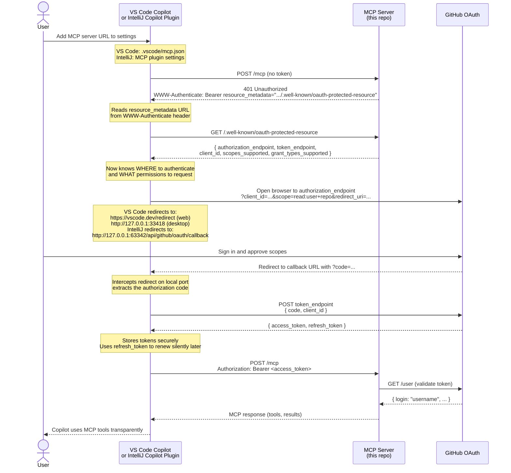

# MCP OAuth with `.well-known` Discovery

[](https://safeskill.dev/scan/aranga-nana-basic-mcp-server-auth)

This project is a runnable TypeScript example of how to protect an MCP server using GitHub as an OAuth authorization server. It teaches the full `.well-known` discovery pattern: how MCP clients like VS Code and IntelliJ find your authorization server automatically, why scopes and grant types matter, and how the browser-based login popup works end-to-end.

The server exposes two MCP tools: `get_status` (returns server health, Copilot quota usage, and today's locally observed usage) and `java_expert_answer` (forwards a Java question to a Copilot session with Java-specific instructions).

---

## The key idea: `.well-known` as the entry point for authentication

The central teaching in this repo is that **an MCP client should never need to be told where to authenticate**. Instead, the server publishes discovery documents at well-known paths, and the client figures out everything — authorization server, token endpoint, scopes, and grant types — from those documents alone.

This follows [RFC 8414](https://datatracker.ietf.org/doc/html/rfc8414) (OAuth Authorization Server Metadata) and the March 2026 MCP authorization guidance.

The moment a client connects to `/mcp` without a token, the server challenges it with a `WWW-Authenticate` header that points to the `.well-known` URL. From that single URL, the client has everything it needs to drive the OAuth flow, open the browser, and retry the request with a fresh token — all without the user manually configuring anything.

---

## The two `.well-known` endpoints

### 1. MCP capability discovery — `GET /.well-known/mcp.json`

This is the **server card**. It tells a client which MCP version the server speaks, where the MCP endpoint lives, and what kind of authentication is required. A client can fetch this before attempting to connect, or it can discover it after receiving a `401`.

```json
{
  "mcp_version": "2025-11-25",
  "server_info": {
    "name": "enterprise-mcp",
    "version": "1.0.0"
  },
  "endpoints": [
    {
      "url": "https://your-mcp-domain.com/mcp",
      "transport": "streamable-http",
      "auth_type": "oauth2"
    }
  ]
}
```

The `auth_type: "oauth2"` field signals that this endpoint is not open. The client must acquire a bearer token before it can use it. Without this field a naive client might attempt unauthenticated access and not understand why it keeps receiving `401`.

### 2. OAuth resource metadata — `GET /.well-known/oauth-protected-resource`

This is where the authentication wiring lives. When a client receives the `401` challenge from `/mcp`, it fetches this document to discover every detail it needs to run the OAuth flow.

```json
{
  "resource": "https://your-mcp-domain.com/mcp",
  "resource_name": "Enterprise Data Server",
  "authorization_servers": [
    "https://github.com/login/oauth"
  ],
  "authorization_endpoint": "https://github.com/login/oauth/authorize",
  "token_endpoint": "https://github.com/login/oauth/access_token",
  "client_id": "YOUR_GITHUB_CLIENT_ID",
  "scopes_supported": ["read:user", "repo", "offline_access"],
  "grant_types_supported": ["authorization_code", "refresh_token"]
}
```

This repo serves this document from Express and populates `client_id` from the `CLIENT_ID` environment variable at runtime.

---

## The `401` challenge: how discovery is triggered

The discovery flow starts from the `WWW-Authenticate` response header. When an unauthenticated request hits `POST /mcp`, the middleware ([src/middleware/validateGitHub.ts](src/middleware/validateGitHub.ts)) returns:

```
HTTP/1.1 401 Unauthorized
WWW-Authenticate: Bearer resource_metadata="http://localhost:3000/.well-known/oauth-protected-resource"
```

This header is the signal to the client. It says: "I require a bearer token, and the metadata document that explains how to get one is at this URL." The client then GETs that URL, reads the authorization and token endpoints from it, and starts the OAuth flow. Every modern MCP client — VS Code, IntelliJ, and CLI tools — understands this challenge format.

```typescript
// src/middleware/validateGitHub.ts
if (!token) {
  res.setHeader(
    "WWW-Authenticate",
    'Bearer resource_metadata="http://localhost:3000/.well-known/oauth-protected-resource"'
  );
  res.status(401).json({ error: "Authentication Required" });
  return;
}
```

---

## Why scopes matter

The `scopes_supported` array in `/.well-known/oauth-protected-resource` is not decorative. It tells the client exactly which GitHub permission scopes to request when building the authorization URL. If the wrong scopes are requested, the resulting token will not have access to the GitHub APIs your server depends on.

This server validates tokens by calling `https://api.github.com/user`. For that to succeed the token needs at minimum `read:user`. If your server also reads repository data, the token needs `repo`.

```json
"scopes_supported": ["read:user", "repo"]
```

**Practical rule:** advertise only the scopes your server actually uses. Over-requesting scopes erodes user trust and may trigger enterprise GitHub App policies that block wide-permission tokens. Under-requesting scopes causes runtime failures when your server tries to call GitHub APIs the token was not granted permission for.

---

## Why grant types matter

The `grant_types_supported` array tells the client which OAuth flows this server's authorization server (GitHub) supports. There are two that matter for IDE clients:

| Grant type | Purpose |
|---|---|
| `authorization_code` | The standard browser-based login flow. The client opens a browser, the user signs in, GitHub redirects back with a code, and the client exchanges the code for a token. |
| `refresh_token` | Allows the client to silently renew an expired access token in the background without requiring the user to log in again. |

```json
"grant_types_supported": ["authorization_code", "refresh_token"]
```

If you omit `refresh_token` from this list, the client will not attempt background renewal. Every time the access token expires (typically after 8 hours when token expiration is enabled), the user will be forced to log in again. For IDEs that stay open for days at a time, this is a significant usability problem.

To enable refresh tokens on the GitHub side, turn on **User-to-server token expiration** in your GitHub OAuth App settings (under Optional features). This causes GitHub to issue a paired refresh token alongside the access token.

---

## IDE callback URLs: VS Code and IntelliJ

When GitHub redirects back after login, it needs to redirect to a URL the IDE is already listening on. These are fixed redirect URI handlers built into each IDE and must be registered in your GitHub OAuth App before the flow will work.

### VS Code

VS Code ships with two built-in redirect handlers:

| URL | Usage |
|---|---|
| `https://vscode.dev/redirect` | Web-based VS Code (vscode.dev) and desktop VS Code remote flows |
| `http://127.0.0.1:33418` | Local VS Code and VS Code Insiders desktop flows |

The desktop handler uses a local HTTP server on port `33418` that VS Code spins up during the OAuth flow. GitHub redirects to `http://127.0.0.1:33418` with the authorization code, VS Code intercepts it, exchanges it for a token, and closes the local server.

### IntelliJ (and other JetBrains IDEs)

IntelliJ uses a local built-in web server that all JetBrains IDEs start automatically:

| URL | Usage |
|---|---|
| `http://127.0.0.1:63342/api/github/oauth/callback` | All JetBrains IDEs (IntelliJ IDEA, PyCharm, WebStorm, etc.) |

Port `63342` is the default JetBrains built-in server port. The callback path `/api/github/oauth/callback` is handled natively by the GitHub plugin that ships with JetBrains IDEs.

### Registering all three

In your GitHub OAuth App, add all three callback URLs under **Authorization callback URL** (GitHub allows multiple). This ensures users on any of these IDEs get a seamless one-click login without extra configuration.

```
https://vscode.dev/redirect
http://127.0.0.1:33418
http://127.0.0.1:63342/api/github/oauth/callback
```

---

## End-to-end authentication flow

Putting it all together, this is what happens when a user adds this MCP server for the first time. The **Client** is the Copilot plugin inside VS Code or IntelliJ — the IDE itself drives every step shown here; there is nothing the user needs to do beyond clicking "Sign in" when the IDE prompts them.



---

## GitHub OAuth App setup

### Create the app

1. Go to **Settings → Developer Settings → OAuth Apps → New OAuth App** in GitHub.
2. Set **Homepage URL** to your MCP server's public base URL.
3. Add all three callback URLs listed in the IDE section above.

### Enable refresh tokens

In the OAuth App settings page, scroll to **Optional features** and enable **User-to-server token expiration**. Without this, GitHub issues non-expiring tokens and the `refresh_token` grant type has no effect.

---

## Requirements

- Node.js 18 or newer
- npm
- A GitHub OAuth App with `CLIENT_ID` and the callback URLs configured above

## Environment setup

Create a `.env.local` file in the project root:

```env
CLIENT_ID=your_github_oauth_app_client_id
```

The server exits on startup if `CLIENT_ID` is missing.

## Install and run

```sh
npm install
npm run build
npm start
```

The server listens on `http://localhost:3000`.

## VS Code MCP configuration

The workspace includes `.vscode/mcp.json` pointing VS Code at the local server:

```json
{
   "servers": {
      "my-mcp-server-1": {
         "url": "http://localhost:3000/mcp",
         "type": "http"
      }
   },
   "inputs": []
}
```

Because `/mcp` is protected, the client must authenticate with a GitHub bearer token.

## User setup

From the MCP user's perspective, setup is intentionally simple:

1. In VS Code, add the MCP server URL to `mcp.json`.
2. When the server challenges the request, follow the GitHub sign-in flow.
3. After authentication, the client retries with the acquired token.

For IntelliJ-style MCP clients, the same discovery endpoints allow the IDE to open its own login flow automatically once the MCP URL is configured.

## Tool behavior

### `get_status`

This tool now reports:

- server health (`System Online`)
- Copilot quota-period usage, including `premium_interactions`
- locally observed usage for the current day, recorded from Java tool sessions

### `java_expert_answer`

This tool creates a Copilot client session using `@github/copilot-sdk`, injects custom Java-focused instructions, sends the provided question, and returns the resulting answer text.

Progress updates are emitted through MCP `notifications/progress` while the tool runs; the final tool response contains only the answer text.

Reasoning-driven progress notifications are currently sent as short step messages with a truncated preview of reasoning deltas.

The current implementation uses:

- model: `gpt-5.4`
- permission handling: `approveAll`
- custom system instructions defined in `src/javaExpertInstructions.ts`

## Project structure

```text
src/
  index.ts                         Express app, MCP server setup, tool registration
  javaExpertInstructions.ts        Java-specific system instructions for Copilot sessions
  middleware/
    validateGitHub.ts             GitHub bearer token validation middleware
  tools/
    registerJavaExpertTool.ts     Java tool registration and Copilot session handling
    registerStatusTool.ts         Status tool registration with Copilot quota lookup
  usage/
    dailyUsageStore.ts            Local per-day Copilot usage ledger for this server
```

## Notes and limitations

- The server URL and OAuth metadata currently use hardcoded `http://localhost:3000` values.
- There is no development watch script yet; use `npm run build` before `npm start`.
- `POST /mcp` is the only authenticated endpoint. The discovery endpoints are public.
- The README includes production-style examples for public deployment, but the checked-in code is a local example server.
- The current implementation does not advertise `offline_access` and does not include a `resource_name` field in the protected-resource metadata.
- Daily usage is local to this server instance and reflects usage observed through `java_expert_answer`; account-wide daily usage is not exposed by this example server.
